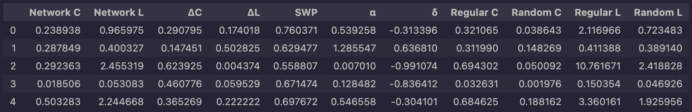
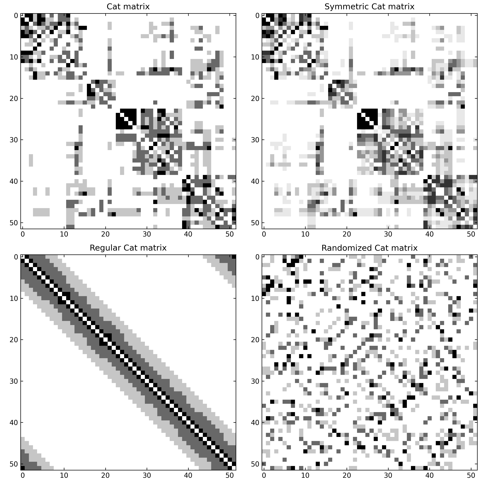
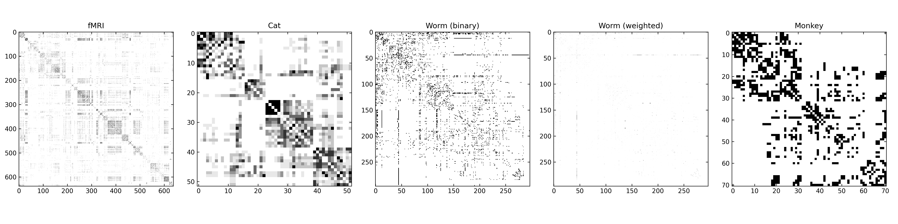
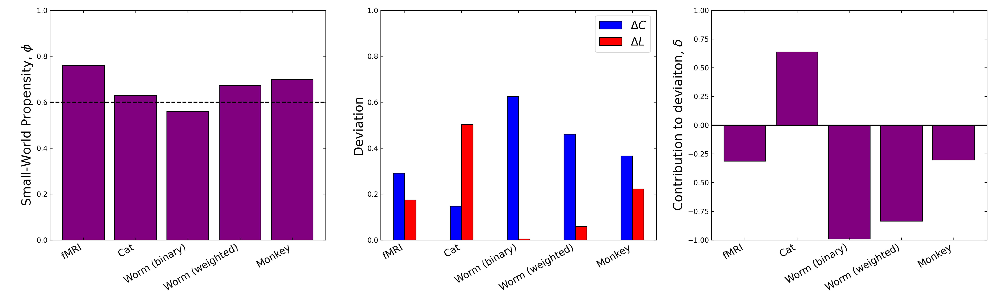

# Small World Propensity

This python package was adapted from the MATLAB package as first presented in [Small-World Propensity and Weighted Brain Networks](https://www.nature.com/articles/srep22057) (2016) by Sarah Feldt Muldoon, Eric W. Bridgeford & Danielle S. Bassett. Their original MATLAB implementation can be found [here](https://kk1995.github.io/BauerLab/BauerLab/MATLAB/lib/+mouse/+graph/smallWorldPropensity.html).

## Use
The small-world propensity package can be installed using pip
```
python -m pip install small-world-propensity
```
`small_world_propensity` can be called in two ways: either with a single adjacency matrix, or with a list of adjacency matrices and a boolean list denoting whether each matrix is binary or not. In either case, `small_world_propensity` will return a `pandas` dataframe similar to the following:


## Generation of regular and random matrices
Using the structural network of the cat cortex obtained from tract-tracing studies between 52 brain regions, we can visualize the process behind the calculation of $\phi$. The matrix is loaded using

```
cat = sio.loadmat('data/cat.mat')['CIJctx']
```
We can then ensure symmetry by calling
```
symm_cat = swp.make_symmetric(cat)
```
In order to get the regular version of the cat matrix, we first find the effective average radius:
```
r = swp.get_avg_rad_eff(symm_cat)
cat_reg = swp.regular_matrix_generator(symm_cat, r)
```
Finally we produce the randomized cat matrix:
```
cat_rand = swp.randomize_matrix(cat_symm)
```


## Comparison of $\phi$ in real networks
We can take the networks used in _Muldoon et al_ and plot $\phi$, $\Delta_L$, $\Delta_C$, and $\delta$. Note that these networks are not the exact same as the ones used in _Muldoon et al_, and due to differences in how Numpy performs permutations, and the use of NetworkX and iGraph libraries, the results are not identical, but still match closely.

The adjacency matrices:


And the results:

